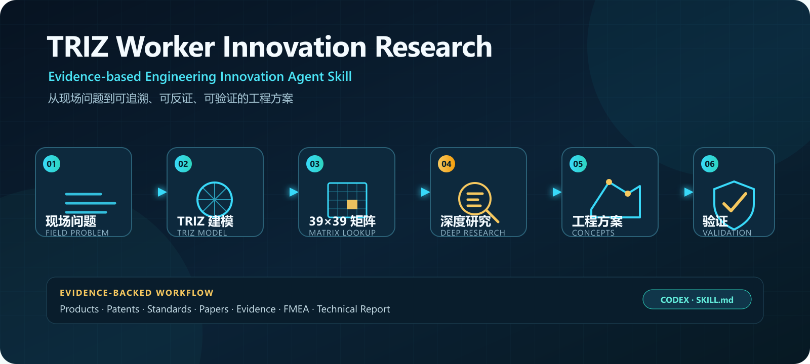

# TRIZ Worker Innovation Research

**Evidence-based Engineering Innovation Agent Skill**

[English](README_EN.md) · [安装](#一分钟开始) · [演示](#一个输入如何变成工程研究包) · [贡献](CONTRIBUTING.md)

[](https://github.com/luchi2333/triz-worker-innovation-research/releases)
[](https://github.com/luchi2333/triz-worker-innovation-research/actions/workflows/validate.yml)
[](LICENSE)

> **不是让 AI 帮你“想几个点子”，而是让 AI 完成一次可追溯、可反证、可验证的工程创新研究。**

将真实工程现场问题转化为：

**问题建模 → TRIZ 矛盾分析 → 39×39 矩阵 → Deep Research → 候选方案 → 风险与 FMEA → 验证试验 → 效益测算 → 技术报告**



适用于工具改进、设备优化、检修工艺和作业流程创新。正式安装路径面向 **OpenAI Codex**；同时按可移植 `SKILL.md` 结构设计，可由支持 Skill 目录或上下文加载的其他 Agent 平台适配使用。

## 一分钟开始

把下面一句话复制给 Codex：

```text
请使用 skill-installer 从以下地址安装技能，安装后告诉我如何开始：
https://github.com/luchi2333/triz-worker-innovation-research/tree/main/triz-worker-innovation-research
```

安装完成后直接描述问题：

```text
请使用 $triz-worker-innovation-research 研究这个职工创新问题：
目前……；主要困难……；希望改善……；不能牺牲……。
```

无需先懂 TRIZ，也无需另外安装矩阵或 Deep Research Skill。实时产品、专利、标准和论文研究仍依赖宿主 Agent 自身具备联网检索能力。

## 为什么不直接让 AI 脑暴？

普通问答往往从一句现场描述直接跳到方案，问题边界、矩阵结果、来源和验证条件难以复核。本 Skill 把研究组织成一条带人工决策点的闭环：

```text
现场问题 → 工序与系统边界 → TRIZ 矛盾 → 矩阵查询 → 用户确认
        → 产品/专利/标准/论文查新 → 候选路线 → 反证与风险 → 试验 → 报告
```

| 普通 TRIZ Prompt / 查询器 | 本 Skill |
|---|---|
| 给出若干发明原理或点子 | 先还原工序、根因、系统边界和约束 |
| 可能凭模型记忆回答矩阵 | 内置 JSON、Python、Node 和 39 个行分片，结果可复算 |
| 搜到资料即作为结论 | 记录检索式，核验来源身份、适配性与反对证据 |
| 输出单一方案 | 同时比较成熟基准、低风险后备、探索路线和超系统替代 |
| 方案写完即结束 | 继续给出 FMEA、决定性试验、停止条件和证据边界 |
| Markdown 写完就宣布完成 | 先探测能力，主动生成必要图示与 DOCX，再用交付清单和成果校验器验收 |

目标不是生成更多文字，而是让 **Engineering Research / Engineering Innovation** 的过程可以被工程师检查、修正和复现。

## 一个输入如何变成工程研究包

以下是**完全虚构的教学示例**，不包含真实企业、型号、项目数据或实测效果。完整结构见 [examples/thin-wall-tube-clamping.md](examples/thin-wall-tube-clamping.md)。

> 某教学车间用台虎钳夹持薄壁铜管锯切，管子容易被夹瘪，后续需要校圆甚至报废。希望夹持更稳，但不能增加管壁变形。

### 1. 先把现场描述变成可检查的问题

- `F`：现场人员报告“夹持后容易失圆”；
- `M`：夹紧力、失圆量和报废率尚未受控测量；
- `S`：后续检索获得的标准、产品、专利和论文来源；
- `H`：钳口接触面积过小导致局部压强过高，是待验证的工程假设。

Skill 会补齐对象、动作链、边界、测量方法和不能牺牲的约束，而不是把假设写成事实。

### 2. 用 TRIZ 把“夹得稳又不夹瘪”变成可查询矛盾

本例把主矛盾映射为：欲改善 **#10 力（强度）**，随之恶化 **#12 形状**，查询方向为 **10×12**。

内置经典 Contradiction Matrix 确定性返回：**#10 预先作用、#35 参数变化、#40 复合材料、#34 抛弃与再生**。这些原理不会停留在编号，而会继续翻译为可试验机制，例如预装可替换衬块、改变接触面形状与刚度、采用硬支承与柔性表层组合、把磨损件设计成可快速更换件。

### 3. 用户先确认，才进入 Deep Research

第一次完整 TRIZ 分析后，Skill 在 `G1.5` 暂停。用户可以修正现场条件、参数映射和研究方向；沉默不等于同意。确认后才检索：

**Products · Patents · Standards · Papers · Manufacturer Documentation · Cross-industry Analogies · Negative Evidence**

### 4. 输出的不是一个点子，而是一套决策材料

```text
问题模型 + TRIZ 推导 + 可复现检索日志 + 证据矩阵
        + 候选方案对比 + FMEA + 决定性试验 + 效益情景 + 技术报告
```

示例只展示工作流，不声称现场性能、专利性或可推广性。

## 一次完整运行会得到什么

| 交付物 | 解决的问题 |
|---|---|
| 问题模型 | 保留原始标识，区分 `F/M/S/H`，明确工序、边界和硬约束 |
| 完整 TRIZ 分析 | 因果/功能、IFR、资源、技术与物理矛盾、物—场和演化方向 |
| 39×39 矩阵记录 | 改善参数作行、恶化参数作列；结果来自确定性资源而非记忆 |
| Deep Research 证据包 | 产品、专利、标准、论文、厂家资料、跨行业类比和反对证据 |
| 候选方案决策表 | 写清“用什么方法解决什么难点”、来源、创新、风险和试验 |
| 验证与 FMEA | 样本、指标、验收/停止条件、决定性试验和 V0—V3 成熟度 |
| 效益模型 | 把现场报告、受控实测和情景假设分开，提供可复算公式 |
| 正式报告 | 先建立 Figure Plan，再生成结构/运动/作用/安全图；交付决策摘要、主报告、技术证据附件、台账、DOCX 和可检查清单 |

## Human-in-the-loop by Design

```text
G0 问题锚定 → G1 TRIZ 建模 → G1.5 用户确认 → G2 深度研究
            → G3 候选方案 → G4 验证/安全/效益 → G5 正式报告
```

用户确认不是装饰。第一次完整 TRIZ 方向稿后，用户可以：

- 修正事实、术语、系统边界和参数映射；
- 保留、暂停、删除或新增研究方向；
- 决定哪些路线值得投入系统查新。

这道门避免错误假设被一路包装成完整报告。

## 技术可信性如何建立

- **确定性矩阵**：内置 39 个工程参数、40 条发明原理、39×39 经典矩阵和 1248 个非空单元；Python、Node 与行分片三种路径可交叉复核。
- **证据可追溯**：结论绑定现场事实、测量、外部来源或工程假设；检索记录保留原始查询式和纳入/排除理由。
- **适配与反证**：相似产品不自动等于适用，跨行业机理不自动等于可行，“未检得”不扩写成市场空白。
- **硬门槛先于评分**：对象身份、证据、适配、类比、安全、专利边界和验证任一关键项失败，成熟度必须降级。
- **普通模型可执行**：状态机、判断树、填空模板和逐阶段检查卡帮助能力一般的模型稳定推进。
- **交付不是后补项**：G5 会先探测绘图、DOCX 和渲染能力；能力可用时主动生成，能力缺失时留下错误证据并明确标记降级交付。
- **原理图先规划再生成**：九类工程图回答不同问题；动态机理用 3～6 帧序列，安全风险单独画边界，系统架构图不能冒充机械原理图。
- **成果也能机器检查**：`validate_deliverables.py` 核对核心图型、SVG/PNG、必需标签、图号、最小字体、图文一致性、检索日志、评分成熟度、DOCX 媒体/链接和逐页检查记录。

## 安装与兼容

### OpenAI Codex

推荐使用上面的“一句话安装”。也可运行内置安装器：

```bash
python ~/.codex/skills/.system/skill-installer/scripts/install-skill-from-github.py \
  --repo luchi2333/triz-worker-innovation-research \
  --path triz-worker-innovation-research
```

Windows PowerShell：

```powershell
python "$env:USERPROFILE\.codex\skills\.system\skill-installer\scripts\install-skill-from-github.py" `
  --repo luchi2333/triz-worker-innovation-research `
  --path triz-worker-innovation-research
```

### Claude Code 与其他 Agent 平台

本项目采用可移植 Skill 目录结构。将 `triz-worker-innovation-research/` 整体复制到平台的 Skill 目录，并以 `SKILL.md` 为入口；没有 Skill 机制的平台可把 `SKILL.md` 作为顶层任务指令，再按其中路由读取 `references/`。

这些平台的版本、权限模型和工具接口各不相同，因此这里表达的是**设计适配方式**，不是对所有平台的已验证兼容承诺。欢迎通过 [Compatibility Report](https://github.com/luchi2333/triz-worker-innovation-research/issues/new?template=compatibility_report.md) 提交真实测试结果。

## 本地验证

```bash
python triz-worker-innovation-research/scripts/validate_skill.py --strict
node triz-worker-innovation-research/scripts/lookup_matrix.mjs --self-test
python triz-worker-innovation-research/scripts/build_report.py --self-test
python triz-worker-innovation-research/scripts/validate_deliverables.py --self-test
```

严格校验覆盖文件清单、版本、矩阵哈希、黄金单元、39 个行分片、README 示例、Python/Node 18 组行为一致性，以及 DOCX 生成器和成果校验器的正负向自检。成果清单 schema 1.1 还会验证 Figure Plan、F4/F5/F7/F8 核心图契约和逐页检查证据。完成实际课题后，复制 `assets/deliverables-manifest-template.json` 到课题输出目录并运行：

```bash
python triz-worker-innovation-research/scripts/validate_deliverables.py \
  --root <课题输出目录> \
  --manifest <课题输出目录>/deliverables-manifest.json \
  --strict
```

## 本 Skill 不声称什么

这是 **AI-assisted engineering research workflow**，不是 automatic invention generator。它不会：

1. 把模型输出当成受控实测；
2. 在没有 `M` 数据时宣称提效、无损或现场收益；
3. 把相似产品参数当成目标现场适配证明；
4. 把跨行业类比直接认定为工程可行；
5. 把有限专利检索当成专利性或 FTO 法律意见；
6. 在没有验证和审批时声称可以现场推广；
7. 自动代替工程师进行最终安全决策。

## 仓库结构

```text
.
├── README.md / README_EN.md
├── CONTRIBUTING.md
├── assets/                         # Hero 与 Social Preview
├── examples/                       # 完全虚构、脱敏的工作流示例
├── docs/launch/                    # 中英文首发传播材料
└── triz-worker-innovation-research/
    ├── SKILL.md                    # Skill 入口与执行契约
    ├── agents/openai.yaml
    ├── assets/                    # 交付清单、报告源与 SVG 模板
    ├── references/                # 工作流、矩阵、查新、模板、交付闸门和报告蓝图
    └── scripts/                   # 矩阵查询、DOCX 生成、成果与技能校验
```

## Roadmap

- [x] 经典 39×39 矩阵与三种确定性查询路径
- [x] G0—G5 + G1.5 人工确认工作流
- [x] Deep Research、证据分层、验证与 FMEA
- [x] Python / Node 跨平台回归与 GitHub Actions
- [x] 中英文首页、公开演示和社区问题模板
- [x] 工程图规划、动态机理序列、安全边界与图示契约校验
- [ ] 增加更多公开、脱敏的工程示例
- [ ] 建立更多 Agent 平台的实测兼容记录
- [ ] 建立社区贡献的回归问题集

## 参与贡献

欢迎报告矩阵或脚本错误、安装问题、Agent 兼容结果，或贡献完全公开且脱敏的工程测试问题。具体方式和隐私边界见 [CONTRIBUTING.md](CONTRIBUTING.md)。

如果这个项目帮助你把“AI 脑暴”变成了可复核的工程研究，欢迎给仓库一个 Star，或提交一个真实的改进建议。

## 许可与归属

原创代码、工作流、模板和说明采用 [MIT License](LICENSE)。经典 TRIZ 方法、参数、发明原理和矩阵归其原始作者及相关权利人；来源与再分发说明见 [THIRD_PARTY_NOTICES.md](THIRD_PARTY_NOTICES.md)。
