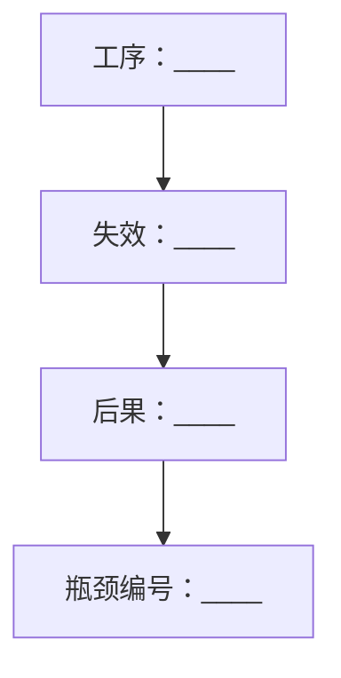

# 最终研究报告蓝图

最终交付的首要目的，是让现场人员、技术负责人和决策者看懂“问题是什么、有哪些解法、每个解法如何工作、推荐什么、凭什么、怎样验证、能产生什么收益”。内部研究治理信息放在证据附件，不挤占技术摘要。

## 1. 交付包

完整项目建议包含四件成果；平台能力不足时可全部用 Markdown/CSV/PNG 交付，内容字段不减少：

1. `01-决策摘要`：4～6 页或等量篇幅，技术方案导向；
2. `02-最终研究报告`：完整问题、TRIZ、深研、方案、验证和效益；
3. `03-技术证据附件`：检索日志、来源卡、证据矩阵、矩阵查询、FMEA、试验协议、假设和声称边界；
4. `04-来源与图示台账`：链接、命题、版权/生成方式、图号、数据来源和版本。

如果用户只要求一种文件，主文件仍须覆盖完整研究内容；其余台账可作为附录。

### 1.1 证据状态必须先于版式完整度

最终文件第一页用一行显示“当前最高证据等级 + 允许的下一动作”，例如概念研究、代理评价、机理验证、模拟现场或获批现场。若对象身份、可复现检索、关键安全屏障或验证一致性任一硬闸门未通过，报告仍可交付为草案，但不得把候选写成定型推荐、制造放行或现场可用。状态行属于技术成熟度信息，不扩写成摘要里的治理性免责声明。

## 2. 决策摘要：技术方案优先

### 2.1 推荐结构

1. **结论先行**：一段话写推荐架构和下一项技术验证；
2. **现场问题**：对象、工序、基线口径、真正瓶颈和必须保留功能；
3. **推荐平台/系统架构**：模块、采用方法、主要解决难点；
4. **TRIZ 结论**：主技术矛盾、欲改善/恶化参数、矩阵单元、推荐原理和关键物理矛盾/物—场；
5. **候选路线决策**：每条路线必须让读者看懂“用什么方法解决什么难点”；
6. **推荐方案如何工作**：按动作顺序写步骤、方法和解决难点；
7. **效益预估**：现场基线与保守/基准/理想情景；
8. **技术安全要求和最小验证顺序**；
9. **关键技术依据**：只列直接影响方案的标准、产品、专利和机理来源。

### 2.2 推荐平台架构表

| 模块 | 采用的方法 | 主要解决的难点 |
|---|---|---|
| 共用底座/接口 | 具体支撑、定位、反力、换型和防错方式 | 对应的位移、变形、误操作或适配难点 |
| 成熟模块 M0 | 直接集成的成熟工具/工艺 | 避免重复研发的子功能 |
| 首选处理头 M1 | 核心动作链和界面 | 主要瓶颈 |
| 后备处理头 M2 | 与 M1 不同的低风险作用拓扑 | M1 失败时仍能解决的难点 |
| 收集/检查/回退 | 收屑、传感、限力、限程、检查 | 污染、隐蔽损伤和失效传播 |

### 2.3 候选路线决策表

“方案”列不能只写路线名称。使用：

| 路线 | 采用的方法及解决的难点 | 价值/证据 | 角色 | 决策 |
|---|---|---|---|---|
| R0 | 用[成熟方法]处理[对象/工序]，解决[难点]；仍不能解决[剩余难点] | 价值分；置信度 | 现实基准/成熟模块 | 保留/退出 |
| R1 | [完整作用链]；通过[机理]解决[失效]；主要风险[风险] | 价值分；置信度 | 工程后备/比较 | 继续/暂停 |
| R2 | [完整作用链]；通过[机理]解决[失效]；主要未知[未知] | 价值分；置信度 | 高潜力探索 | 优先否证 |
| R3 | [采购/预制/工序前移]从超系统消除[现场步骤] | 价值分；置信度 | 替代路线 | 同步保留 |

### 2.4 推荐方案动作链表

| 步骤 | 采用的方法 | 解决的技术难点 |
|---|---|---|
| A 定位/准备 | 输入识别、定位、支撑和前置检查 | 对象身份、偏移、基准不稳 |
| B 成熟预处理 | 成熟模块完成前级工序 | 重复劳动和不稳定入口 |
| C 首选核心动作 | M1 的局部作用链、能量/信息/材料流 | 主瓶颈 |
| D 工程后备 | M2 的低能量/可回退动作 | M1 卡滞或不适配 |
| E 收集与防错 | 污染控制、保留功能和机械止动 | 碎屑、误切、混淆 |
| F 检查与回退 | 逐级检查、限力/限程、异常回退 | 隐蔽损伤和错误传播 |

### 2.5 摘要中减少的内容

以下内容如需保留，放入技术证据附件或内部审查记录，不单列为摘要章节：

- 大段“当前禁止声称”清单；
- AI 辅助透明度说明；
- 研究责任边界、内部审批过程和检索工作量；
- 与推荐方案无直接关系的矩阵转录纠错过程；
- 冗长的专利法律免责声明。

摘要仍需用准确措辞表达成熟度和验证阶段，但以技术信息为主体。

摘要中的型号、结构、适配、安全、性能和专利判断必须在相邻句或表格单元给出 `F/M/S/H`、命题 ID 或来源 ID。附件可承载完整审计信息，但不能要求读者跨文件猜测某项关键结论的依据。

## 3. 主报告结构

### 封面与技术摘要

写题名、研究对象、版本、日期和当前技术阶段。摘要回答问题、主矛盾、推荐架构、主要证据、技术风险、效益情景和下一验证。

### 第 1 章 研究对象与任务边界

- 原始问题和用户修正；
- 代表型号/对象及证据状态；
- 研究目标、系统边界、适用/不适用场景；
- 直接或代理证据模式；
- 决策用途。

保留用户原始标识，并列展示候选解释与确认依据；不得在正文中无痕替换为相似“规范型号”。若身份差异影响结构或安全，明确说明因此暂不冻结哪些尺寸、材料和接口。

### 第 2 章 现场问题的具体分析

必须详细到能够支持设计：

- 对象结构、材料和可变因素；
- 从准备到检查/清理/返工的完整工序；
- 分工序时间、人力、质量、风险和等待；
- 3～6 个工程瓶颈；
- 每个瓶颈的“变化因素→直接机理→可观察失效→工程后果→未知”；
- 超系统—系统—子系统、功能模型和因果链；
- 现行最佳方法而非只用最差人工方法作基准。

配图：典型结构/情景图、完整工序图、现场问题链。若没有目标照片，明确标“典型情景/概念图”，不能冒充目标型号剖面。

### 第 3 章 TRIZ 完整分析

按 [triz-analysis-output.md](triz-analysis-output.md) 展开：IFR/资源、EC1/EC2、主次参数映射、逐单元矩阵、40 原理现场化、物理矛盾分离、物—场/标准解、演化和裁剪、TRIZ—方案映射。

矩阵结果表必须显示欲改善/恶化参数及查表方向；任何额外使用的原理要标明来自物理矛盾、系统扫描或其他 TRIZ 工具，不能冒充矩阵推荐。

### 第 4 章 深度查新与技术空间

- 标准/监管和项目工艺硬约束；
- 型号/结构证据；
- 现成产品能力与完整流程差距；
- 专利机理族、权利要求碰撞和可避让空间；
- 论文/手册支持的材料与物理机理；
- 跨行业类比；
- 失败、限制和采购/流程替代；
- 检索后对原模型的修正。

本章同时给出逐条原始检索日志的存放位置、来源五维核验、产品适配表、类比迁移卡和未检得覆盖等级。只有来源数量或查询总数而无原始查询式时，必须写“检索日志未闭合”，不得宣布深研完成。

结论采用“本次检索范围内发现/未发现同时满足某组合约束”，不写绝对不存在。

### 第 5 章 候选方案与推荐系统架构

先给方案全景和决策表，再给推荐架构模块/接口图。至少包括成熟基准、工程后备、高潜力探索和超系统替代。产品标称范围未与目标实物比较时只写“待适配的成熟基准”；类比关键边界不同时只写“优先否证的机理假设”。

### 第 6 章 各备选方案的技术原理与创新归属

每个方案使用同一张“方案卡”：

| 维度 | 必填内容 |
|---|---|
| 要解决的难点 | 对应瓶颈、根因和失效 |
| 技术原理 | 作用对象、动作链、力/能量/信息/材料流 |
| TRIZ 追溯 | 参数对、矩阵原理、分离/物—场/演化 |
| 成熟已有技术 | 可直接集成的产品、工艺、机构或标准做法 |
| 成熟技术来源 | 原厂手册、专利、论文、标准等来源 ID |
| 本项目场景化集成 | 如何适配现场长度、空间、人员、工序和接口 |
| 候选创新部分 | 与既有技术相比的差异作用链，不是需求口号 |
| 解决现有问题 | 逐项说明如何消除/降低原失效 |
| 进一步提升 | 对质量、安全、稳定性、标准化、维护等额外增益 |
| 风险/否证 | 最敏感参数、危险失效、最低成本推翻条件 |
| 验证状态 | F/M/S/H；不得把概念写成已实现 |

每个进入决策的方案至少配一张自绘原理图。图中标出对象、工具、运动方向、保护界面、作用力/场、废料/信息流、保留功能和停止边界。

若图或文字把对象材料、摩擦、手感、软件判断或单一传感器画成止挡/保险/联锁，必须提供独立屏障依据和最不利验证；否则删除安全功能表述，并将路线退回硬门槛。

### 第 7 章 方案比较与选择

先做硬门槛，再做加权评分。写：

- 各路线为什么保留、暂停或淘汰；
- 可行性/价值分与证据置信度分别是多少；
- 推荐方案、工程后备、现实基准和退出自研条件；
- 去掉最强支持证据后推荐是否仍成立；
- 最强反对意见。

所有分数必须公开指标、权重、0/1/3/5 锚点、评分者、计算式和证据 ID；未知项写 `?`。缺少这些字段时使用定性比较，不输出看似精确的总分。技术检索不写 FTO 通过，只写潜在重叠与专业复核状态。

### 第 8 章 安全、FMEA 与验证

- 预期用途、禁止用途、可预见误用；
- 本质安全→工程防护→安全控制→信息/管理；
- 危险事件、原因、后果、控制、残余风险、验证编号；
- 短样机理→长段连续→完整流程→模拟现场→获批现场；
- 样本身份、对照、变量、记录字段、通过/停止/升级条件；
- 质量/安全硬门槛通过后才计算效率。

验证表必须检查“计划样本—已完成样本—最不利条件—检测及检出限—全部通过—立即停止—升级”是否一致。升级条件不能低于本级最低样本和全部判据；目视未见不能自动证明无隐蔽损伤，“零损伤”必须改成限定样本、方法和检出限的观测结果。

### 第 9 章 社会效益与经济效益

#### 经济效益

至少计算：

- 现行完整人工时 `H0`；
- 平台完整人工时 `H1`（含准备、换型、检查、清理、维护和返工）；
- 净节省 `ΔH = H0 - H1`；
- 临界批量；
- 年人工价值；
- 初始投入、耗材、运维、培训和折旧；
- 回收期与 3～5 年 NPV（如数据足够）；
- 保守/基准/理想三种情景和敏感性因素。

现场报告值、受控实测和情景假设分开。人工时节省不自动等于关键路径工期缩短。

#### 社会效益

给可测指标而不是宣传语：

- 开放刀刃暴露时间、危险区进入次数；
- 非目标层损伤率、一次合格率、返工/换件；
- 导电/有害碎屑封闭收集率；
- 完整时间中位数、P90、跨人员变异；
- 训练达到稳定节拍所需工件数；
- 工艺记录完整率、错配拦截率；
- 可复用模块、耗材和废料回收。

### 第 10 章 实施路径与结论

- 下一项最低成本决定性试验；
- Alpha、完整流程、模拟现场和推广闸门；
- 采购/许可/预制/退出自研条件；
- 当前推荐架构及适用边界；
- 仍未解决的关键未知。

主报告结论只保留与技术决策相关的限制；详细声称控制、检索不足和 AI 辅助说明放附件。

## 4. 技术证据附件

至少包含：

1. 研究台账和 F/M/S/H；
2. 逐单元矩阵脚本输出与矩阵版本；
3. 检索式、日期、来源卡和纳入/排除；
4. 命题级证据矩阵；
5. 产品、标准、专利、论文 WHY/HOW/WHAT；
6. 专利权利要求碰撞表；
7. 方案追溯和创新分层；
8. 硬门槛、加权评分和证据置信度；
9. FMEA 和验证协议；
10. 效益公式、输入值、来源和敏感性；
11. 当前声称边界、研究透明度和责任复核记录。
12. 原始标识身份表、产品适配表、类比迁移卡、安全屏障真实性表和验证一致性表。

这些内容保证可审计，但不应复制到摘要造成技术信息被淹没。

## 5. 图示与网络资料规则

### 5.1 图示选型表

按图的内容类型选择格式，不设全局默认。Mermaid 只用于节点—连线类图，不得用于复杂机械原理图：

| 图的内容类型 | 首选格式 | 兜底格式 | 禁止用法 |
|---|---|---|---|
| 流程/工序步骤 | Mermaid `flowchart` | ASCII | — |
| 因果链/功能链 | Mermaid `flowchart` | ASCII | — |
| 状态机/闸门 | Mermaid `stateDiagram` | ASCII | — |
| 机理/几何/结构原理 | 自绘 SVG（标注对象、工具、力、方向、边界） | 平台原生可编辑图形 | 不得用 Mermaid 表达空间结构 |
| 数据对比（有数值） | 平台原生图表（Excel/Word 图表） | Markdown 表格 + 文字 | 不得用 Mermaid 画柱状图 |
| 目标为 Word/PPT 的插图 | 平台原生可编辑图形（SmartArt/形状/图表） | SVG 导入后转可编辑 | 不优先 Mermaid |

选型规则：

1. 先判断内容类型，再选格式；同一内容类型在四件成果中格式保持一致；
2. Mermaid 图节点文字必须来自已写出的台账字段（工序名、瓶颈名、方案编号），不得在图里发明新术语；
3. 机理/几何图若无力/方向/边界标注能力，宁可降级为“文字动作链 + ASCII 示意”，不得用流程图冒充原理图；
4. ASCII 图仅作平台不支持任何图形时的兜底，须保持等宽字体并标注“文字示意图”。

### 5.2 三类图模板

**Mermaid 流程/因果图模板**（节点数 ≤ 12，超过先拆分）：

**SVG 机理图模板**（自绘，必须包含以下标注才合格）：

- 对象与工具的相对位置和接触界面；
- 运动方向箭头与作用力标注；
- 保护界面/停止边界（虚线或加粗）；
- 废料/信息流走向；
- 图题下标注“概念原理图/非制造图”与版本号。

**原生可编辑图形模板**（Word/PPT 交付时）：

- 用 SmartArt/形状复刻决策摘要中的推荐架构表（模块—接口关系）；
- 用原生图表承载效益情景对比（保守/基准/理想）；
- 所有形状保留可编辑状态，不插入位图截图替代；
- 与 Markdown 版内容字段一一对应，编号一致。

### 5.3 必要图示

- 对象/典型结构图（SVG 或原生图形）；
- 现场问题链或完整工序图（Mermaid）；
- TRIZ 主矛盾到作用机制追溯图（Mermaid）；
- 每个入选方案的原理图（SVG 或原生图形）；
- 推荐系统架构与模块接口图（Mermaid 或原生图形）；
- 验证闸门（Mermaid `stateDiagram`）；
- 效益敏感性图（有数值时，原生图表）。

### 5.4 网络图片

优先收集原厂产品图、专利附图和标准机构示意图作为研究资料。嵌入报告前核对版权/许可并标来源；若授权不清，只给链接和文字说明，改用原创概念图。不得把竞品照片改色后当作本项目方案。

### 5.5 自绘/生成图

图必须由已写出的作用机制驱动，不允许图先于方案；格式按 5.1 选型表选择。标注“概念原理图/非制造图”；尺寸、材料和效果没有 M/S 时不画成定型参数。图示台账记录：图号、文件、性质、依据、生成/绘制方式、来源和使用限制。

## 6. 写作与版式

- 结论先行，段落回答一个问题；
- 用现场语言说明作用机制，再补 TRIZ 名称；
- 表格列名使用可执行字段，避免只有“优点/缺点”的空泛比较；
- 所有数字带单位、口径和 F/M/S/H；
- 引用紧邻命题，来源台账可回链；
- 图表有标题、编号、单位、来源和边界；
- 不使用“颠覆性、革命性、彻底、绝对、零风险”等无证据修辞；
- 同一术语、模块编号、路线编号和版本在四件成果中一致。

## 7. 生成后的实际检查

不能只检查文件存在或文档 XML：

1. 打开或渲染最终文件；
2. 逐页查看标题、表格、图片、脚注、页码和跨页；
3. 确认没有空白页、截断、乱码、损坏链接或低清图；
4. 抽查所有关键数字和来源 ID；
5. 对摘要执行“技术占比检查”：读者是否能在两页内看懂方法、难点和动作链；
6. 对主报告执行“追溯抽查”：随机选三个结论，能否回到命题、来源/试验和适用边界；
7. 对“推荐、适配、安全、空白、专利、效果”执行 `身份—证据—适配—类比—安全—专利—验证` 七问；
8. 检查上游闸门失败是否在摘要、方案角色和允许动作中一致降级；
9. 修复后重新渲染检查，不以结构测试通过代替视觉验收。
